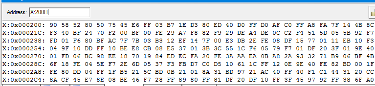
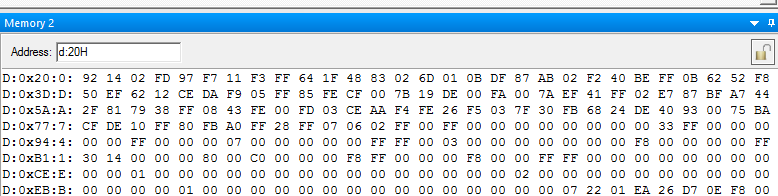

# 实验一 单片机开发系统的使用
<div class="author" style="text-align:center">实验人:杨庆龙<br/>实验日期:2018.3.14</div>

## 实验目的
* 初步了解MCS-51系列单片机及其存储器构成，对存储器的管理方法
* 初步了解MCS-51系列单片机指令系统
* 熟悉单片机开发系统及开发工具的基本操作方法
* 掌握系统调试和运行程序的基本方法
## 实验原理
### MCS-51单片机的主要寄存器
* 程序计数寄存器:PC
* 数据指针:DPTR=DPH+DPL
* 累加器A:存放操作数并保存计算结果
* 累加器B:在乘除法中用来保存乘数或除数
* 工作寄存器:R0-R7,只有R0，R1可以间接寻址
* 堆栈指针:SP
* 程序状态字:PSW
### C8051F020简介
#### 标准外设部件
* 5个16为计数/定时器
* 两个全双工UART，256字节内部RAM
* 128字节特殊功能寄存器地址空间
* 8/4字节IO口
#### 增加功能
* 22个中断源
* 7个复位源
* 独立时钟生成器
## 实验内容
### 熟悉Keil软件
1. 打开Keil
2. 新建Project
3. 写入HelloWorld
4. 添加源文件到Source Group
5. 设置调试方法
6. 编译
7. 启动调试
8. 检查程序运行结果
### 两个十进制数相加
编译源码1，检查程序运行结果
### 多个十进制数相加
编译源码2，检查程序运行结果
## 实验结果
### 两个十进制数加法
使用Keil将样例代码烧录进开发板中，可以观察到实验指导书中的内容，故此处不再赘述。
### 多个十进制数加法
#### 烧录
将代码中加数个数设置为3，再将该代码烧录到开发板中。又使用MemoryWindow功能查看运行结束后开发板相应内存处的数据可得如图
#### 现象观察
###### 加数内存查看窗口截图

其中，加数储存以0x200开始，按照{低位，高位}的方式存储，共三个。
###### 计算结果内存查看窗口截图

其中，计算结果的低八位存在0x20处，高位八位存在0x21处，进位存在0x22处。
#### 结果核定
算式为5890+8052+7550=21492，与查看内存所得到的结果相同，符合要求。
## 思考题
1. 并不是必须的，但如果没有SJMP $,程序状态将变得不可控，我们也就有可能得不到想要的结果
2. 先测试两个数加法是否运行正常，再对N个最大的数求和。
3. 汇编如果没有对看门狗进行设置，程序会定时复位，我们将不能得到一个稳定的程序状态。
## 源码
### 源码一_两个十进制数相加
```
WDTCN DATA 0FFH ;定义地址常量
ORG 0000H ;程序定位
AJMP START ;跳转到标号
ORG 0100H ;程序定位
START:
MOV WDTCN, #0DEH
MOV WDTCN, #0ADH ;禁止看门狗电路复位
MOV R0, #20H ;设置内部数据存储器间接寻址指针
MOV DPTR, #CONST ;设置程序存储器数据指针
CLR A
MOVC A, @A+DPTR ;读程序存储器数据
MOV R1, A ;保存加数低位
CLR A
INC DPTR ;指针地址加1
MOVC A, @A+DPTR
MOV R2, A ;保存加数高位
MOV DPTR, #0000H ;设置外部数据存储器指针1.3 实验内容 5
MOVX A, @DPTR
ADD A, R1 ;先加低位
DA A ;十进制数加法调整
MOV @R0, A ;写内部数据存储器（间接寻址只能@R0或@R1）
INC DPTR
INC R0 ;内部数据指针加1
MOVX A, @DPTR
ADDC A, R2 ;带进位加高位
DA A ;十进制数加法调整
MOV @R0, A ;保存高位
INC R0
CLR A
MOV ACC.0, C ;将进位位赋值给寄存器A的最低位
MOV @R0, A ;保存最高进位位
SJMP $ ;原地循环
CONST:
DW 1234H ;加数
END
```
### 源码二_N个十进制数相加
```
WDTCN DATA 0FFH
ORG 0000H
AJMP START
ORG 0100H
START:
MOV WDTCN, #0DEH
MOV WDTCN, #0ADH
MOV R0, #20H
MOV @R0, #00H
INC R0
MOV @R0, #00H
INC R0
MOV @R0, #00H;clear 20H,21H,22H
MOV DPTR, #COUNT
CLR A
MOVC A, @A+DPTR
MOV R7, A
MOV DPTR, #0200H;numbers' location in Xram
LOOP:
MOV R0, #20H
MOV A, @R0
MOV R1, A
MOVX A, @DPTR
ADD A, R1
DA A
MOV @R0, A; Low 8 bits
INC R0
INC DPTR
MOV A, @R0
MOV R1, A
MOVX A, @DPTR
ADDC A, R1
DA A
MOV @R0, A; High 8 bits
INC R0
MOV A, @R0
MOV R1, A
CLR A
ADDC A, R1
DA A
MOV @R0, A; Extra bits
INC DPTR
DJNZ R7, LOOP
SJMP $
COUNT:
DB 03H
END
```
